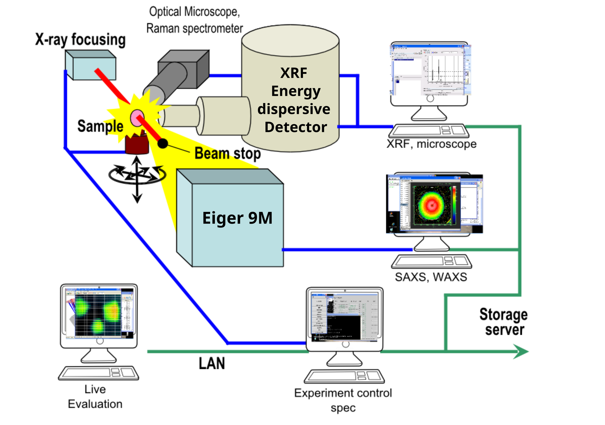
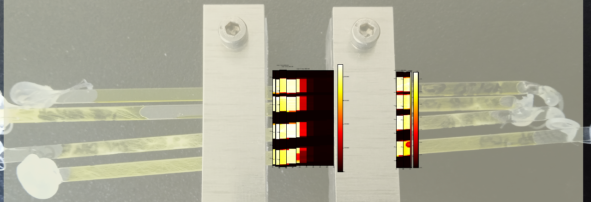

# Common Context for All Challenges

The dataset originates from a cuvette scan experiment at the mySpot beamline (BESSY II). The data acquistion of mySpot beamline is shown below. 

In this experiment, a grid scan is performed across multiple cuvettes (see figure below), and at each scan point fluorescence (XRF) and diffraction (XRD) measurements are recorded simultaneously. The goal of the experiment was to correlate the occurence of crystallization phases with elemental distribution.

The experimental data is provided in a raw acquisition format consisting of many small files:

- One file per scan point per technique

- Separate subfolders for each technique (e.g., fluorescence and diffraction)

- A master metadata file containing scan parameters, motor positions, and acquisition order

- A minimal ELN-style YAML file containing experimenter and sample metadata not captured during acquisition

Participants should use the building blocks that they learnt on Day 1 of the datathon to convert this data into NeXus format and upload the final result to NOMAD.
